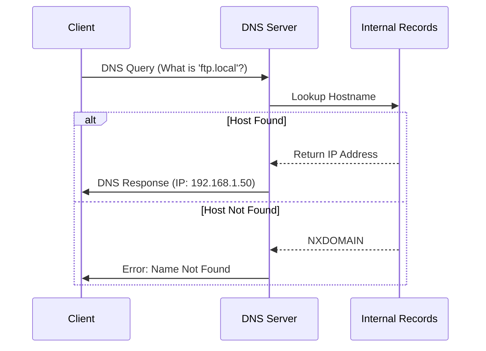

### DNS Flow Chart:

---

```mermaid
sequenceDiagram
    participant C as Client
    participant D as DNS Server
    participant DB as Internal Records
    
    C->>D: DNS Query (What is 'ftp.local'?)
    D->>DB: Lookup Hostname
    
    alt Host Found
        DB-->>D: Return IP Address
        D->>C: DNS Response (IP: 192.168.1.50)
    else Host Not Found
        DB-->>D: NXDOMAIN
        D->>C: Error: Name Not Found
    end
```