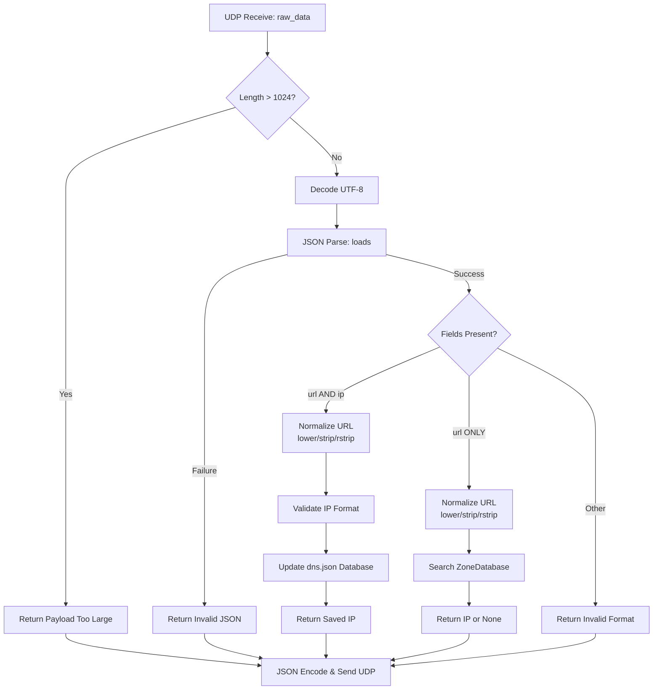

### JSON DNS Flow Chart:

---

```mermaid
flowchart TD
    A[UDP Receive: raw_data] --> B{Length > 1024?}
    B -- Yes --> C[Return Payload Too Large]
    B -- No --> D[Decode UTF-8]
    
    D --> E[JSON Parse: loads]
    E -- Failure --> F[Return Invalid JSON]
    E -- Success --> G{Fields Present?}
    
    G -- url AND ip --> H[Normalize URL\nlower/strip/rstrip]
    H --> I[Validate IP Format]
    I --> J[Update dns.json Database]
    J --> K[Return Saved IP]
    
    G -- url ONLY --> L[Normalize URL\nlower/strip/rstrip]
    L --> M[Search ZoneDatabase]
    M --> N[Return IP or None]
    
    G -- Other --> O[Return Invalid Format]
    
    K & N & O & C & F --> P[JSON Encode & Send UDP]
```