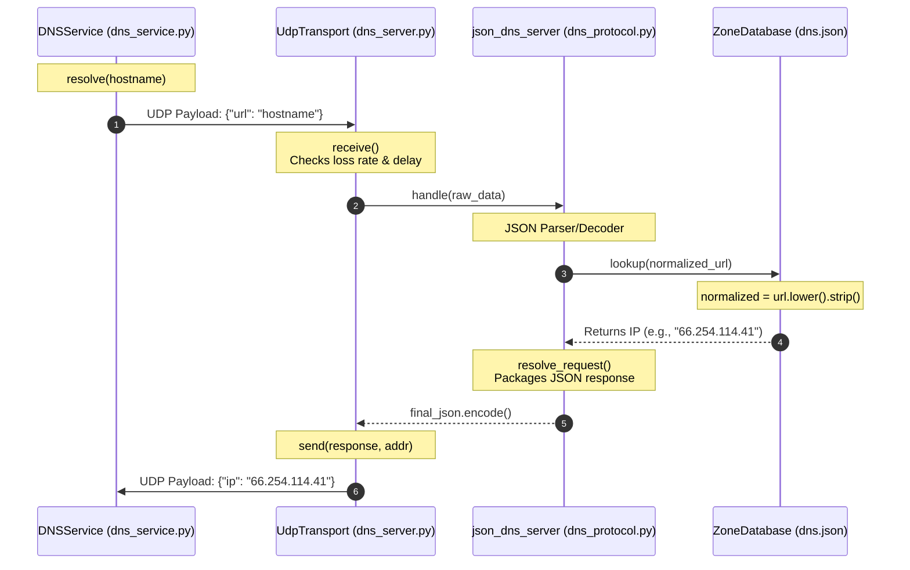

### JSON DNS Flow Chart:

---

```mermaid
sequenceDiagram
    autonumber
    participant Client as DNSService (dns_service.py)
    participant Net as UdpTransport (dns_server.py)
    participant Logic as json_dns_server (dns_protocol.py)
    participant DB as ZoneDatabase (dns.json)

    Note over Client: resolve(hostname)
    Client->>Net: UDP Payload: {"url": "hostname"}
    
    Note over Net: receive()<br/>Checks loss rate & delay
    Net->>Logic: handle(raw_data)
    
    Note over Logic: JSON Parser/Decoder
    Logic->>DB: lookup(normalized_url)
    Note over DB: normalized = url.lower().strip()
    DB-->>Logic: Returns IP (e.g., "66.254.114.41")
    
    Note over Logic: resolve_request()<br/>Packages JSON response
    Logic-->>Net: final_json.encode()
    
    Note over Net: send(response, addr)
    Net->>Client: UDP Payload: {"ip": "66.254.114.41"}
```