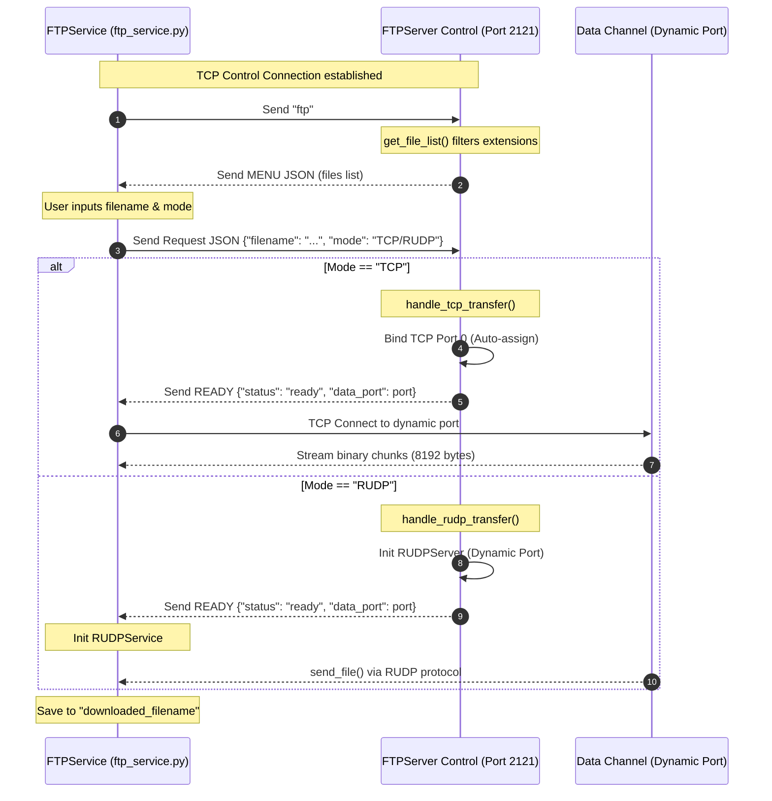

### FTP Flow Chart:

---

```mermaid
sequenceDiagram
    autonumber
    participant Client as FTPService (ftp_service.py)
    participant Srv_Ctrl as FTPServer Control (Port 2121)
    participant Srv_Data as Data Channel (Dynamic Port)

    Note over Client, Srv_Ctrl: TCP Control Connection established
    
    Client->>Srv_Ctrl: Send "ftp"
    Note over Srv_Ctrl: get_file_list() filters extensions
    Srv_Ctrl-->>Client: Send MENU JSON (files list)
    
    Note over Client: User inputs filename & mode
    Client->>Srv_Ctrl: Send Request JSON {"filename": "...", "mode": "TCP/RUDP"}
    
    alt Mode == "TCP"
        Note over Srv_Ctrl: handle_tcp_transfer()
        Srv_Ctrl->>Srv_Ctrl: Bind TCP Port 0 (Auto-assign)
        Srv_Ctrl-->>Client: Send READY {"status": "ready", "data_port": port}
        Client->>Srv_Data: TCP Connect to dynamic port
        Srv_Data-->>Client: Stream binary chunks (8192 bytes)
    else Mode == "RUDP"
        Note over Srv_Ctrl: handle_rudp_transfer()
        Srv_Ctrl->>Srv_Ctrl: Init RUDPServer (Dynamic Port)
        Srv_Ctrl-->>Client: Send READY {"status": "ready", "data_port": port}
        Note over Client: Init RUDPService
        Srv_Data-->>Client: send_file() via RUDP protocol
    end

    Note over Client: Save to "downloaded_filename"
```