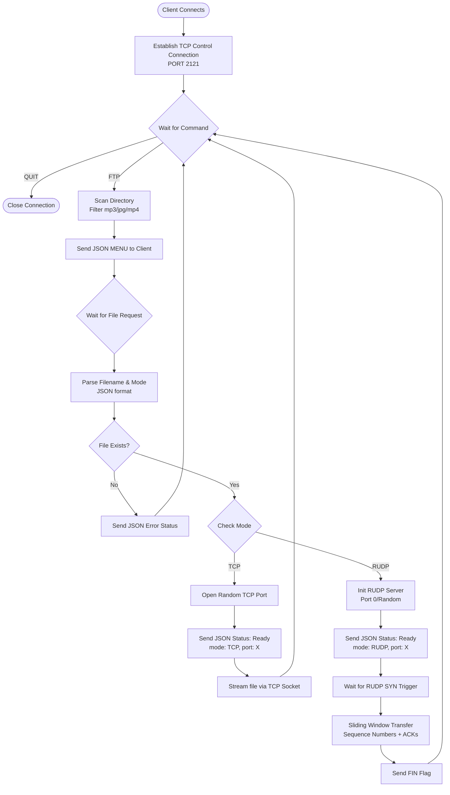

### FTP Flow Chart:

---

```mermaid
flowchart TD
    Start([Client Connects]) --> TCP_Control[Establish TCP Control Connection\nPORT 2121]
    TCP_Control --> Wait_Cmd{Wait for Command}
    
    Wait_Cmd -- "QUIT" --> Close([Close Connection])
    
    Wait_Cmd -- "FTP" --> ListFiles[Scan Directory\nFilter mp3/jpg/mp4]
    ListFiles --> SendMenu[Send JSON MENU to Client]
    
    SendMenu --> WaitReq{Wait for File Request}
    
    WaitReq --> ParseReq[Parse Filename & Mode\nJSON format]
    
    ParseReq --> CheckFile{File Exists?}
    CheckFile -- "No" --> SendError[Send JSON Error Status] --> Wait_Cmd
    
    CheckFile -- "Yes" --> ModeSplit{Check Mode}
    
    %% TCP Path
    ModeSplit -- "TCP" --> TCP_Data[Open Random TCP Port]
    TCP_Data --> SendReadyTCP[Send JSON Status: Ready\nmode: TCP, port: X]
    SendReadyTCP --> TCP_Stream[Stream file via TCP Socket]
    TCP_Stream --> Wait_Cmd
    
    %% RUDP Path
    ModeSplit -- "RUDP" --> RUDP_Init[Init RUDP Server\nPort 0/Random]
    RUDP_Init --> SendReadyRUDP[Send JSON Status: Ready\nmode: RUDP, port: X]
    SendReadyRUDP --> RUDP_SYN[Wait for RUDP SYN Trigger]
    RUDP_SYN --> RUDP_Sliding[Sliding Window Transfer\nSequence Numbers + ACKs]
    RUDP_Sliding --> RUDP_FIN[Send FIN Flag]
    RUDP_FIN --> Wait_Cmd
```