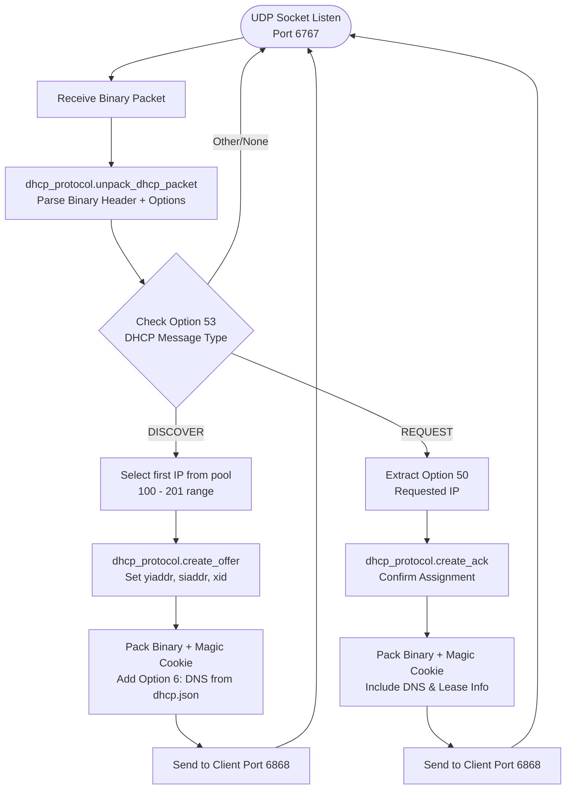

### DHCP Flow Chart:

---

```mermaid
flowchart TD
    Start([UDP Socket Listen\nPort 6767]) --> Receive[Receive Binary Packet]
    Receive --> Unpack[dhcp_protocol.unpack_dhcp_packet\nParse Binary Header + Options]
    
    Unpack --> MsgType{Check Option 53\nDHCP Message Type}
    
    %% DISCOVER Logic
    MsgType -- DISCOVER --> GetIP[Select first IP from pool\n100 - 201 range]
    GetIP --> CreateOffer[dhcp_protocol.create_offer\nSet yiaddr, siaddr, xid]
    CreateOffer --> PackOffer[Pack Binary + Magic Cookie\nAdd Option 6: DNS from dhcp.json]
    PackOffer --> SendOffer[Send to Client Port 6868] --> Start

    %% REQUEST Logic
    MsgType -- REQUEST --> ExtractReq[Extract Option 50\nRequested IP]
    ExtractReq --> CreateAck[dhcp_protocol.create_ack\nConfirm Assignment]
    CreateAck --> PackAck[Pack Binary + Magic Cookie\nInclude DNS & Lease Info]
    PackAck --> SendAck[Send to Client Port 6868] --> Start

    %% Fallback
    MsgType -- Other/None --> Start
```