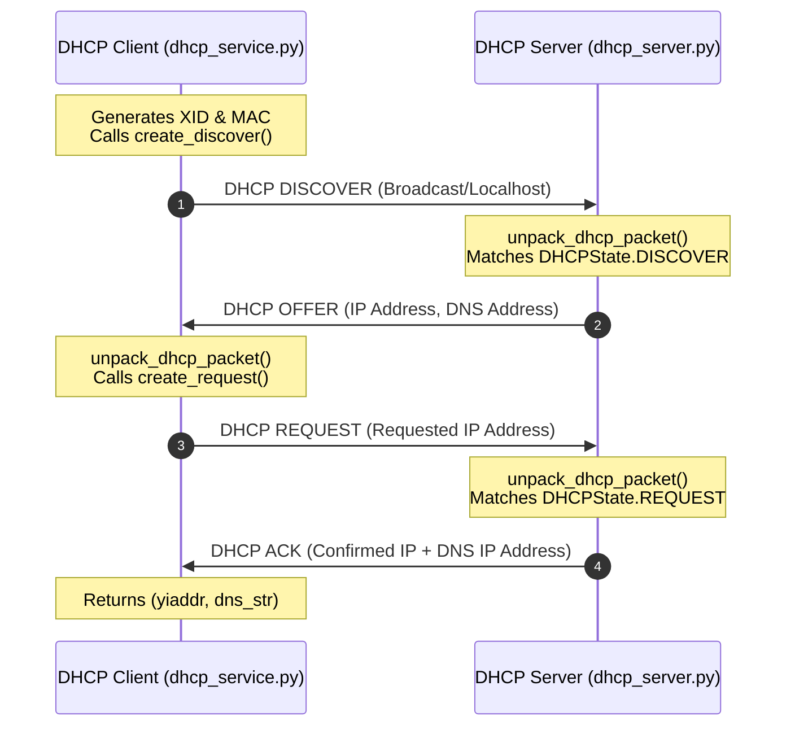

### DHCP Flow Chart:

---

```mermaid
sequenceDiagram
    autonumber
    participant Client as DHCP Client (dhcp_service.py)
    participant Server as DHCP Server (dhcp_server.py)

    Note over Client: Generates XID & MAC<br/>Calls create_discover()
    Client->>Server: DHCP DISCOVER (Broadcast/Localhost)
    
    Note over Server: unpack_dhcp_packet()<br/>Matches DHCPState.DISCOVER
    Server->>Client: DHCP OFFER (IP Address, DNS Address)
    
    Note over Client: unpack_dhcp_packet()<br/>Calls create_request()
    Client->>Server: DHCP REQUEST (Requested IP Address)
    
    Note over Server: unpack_dhcp_packet()<br/>Matches DHCPState.REQUEST
    Server->>Client: DHCP ACK (Confirmed IP + DNS IP Address)
    
    Note over Client: Returns (yiaddr, dns_str)
```