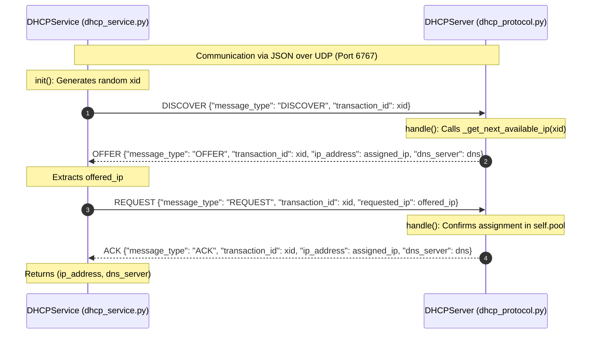

### JSON DHCP Flow Chart:

---

```mermaid
sequenceDiagram
    autonumber
    participant Client as DHCPService (dhcp_service.py)
    participant Server as DHCPServer (dhcp_protocol.py)
    Note over Client, Server: Communication via JSON over UDP (Port 6767)

    Note over Client: init(): Generates random xid
    Client->>Server: DISCOVER {"message_type": "DISCOVER", "transaction_id": xid}

    Note over Server: handle(): Calls _get_next_available_ip(xid)
    Server-->>Client: OFFER {"message_type": "OFFER", "transaction_id": xid, "ip_address": assigned_ip, "dns_server": dns}

    Note over Client: Extracts offered_ip
    Client->>Server: REQUEST {"message_type": "REQUEST", "transaction_id": xid, "requested_ip": offered_ip}

    Note over Server: handle(): Confirms assignment in self.pool
    Server-->>Client: ACK {"message_type": "ACK", "transaction_id": xid, "ip_address": assigned_ip, "dns_server": dns}

    Note over Client: Returns (ip_address, dns_server)
```