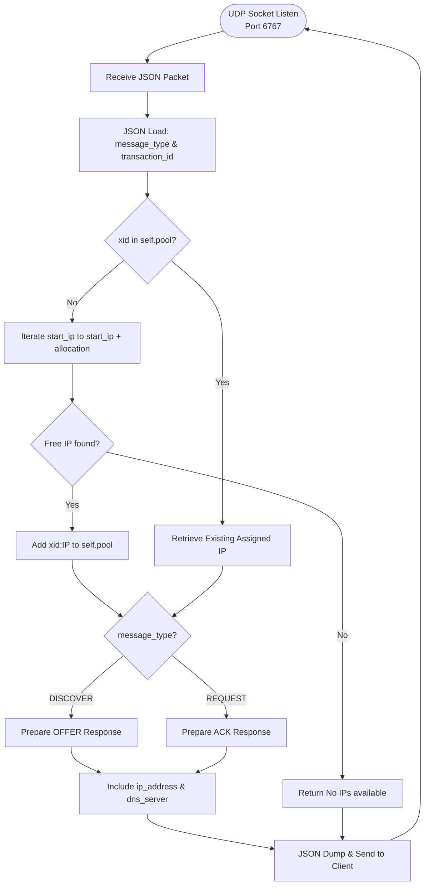

### JSON DHCP Flow Chart:

---

```mermaid
flowchart TD
    Start([UDP Socket Listen\nPort 6767]) --> Receive[Receive JSON Packet]
    Receive --> Decode[JSON Load: message_type & transaction_id]
    
    Decode --> PoolCheck{xid in self.pool?}
    
    %% IP Pool Management logic
    PoolCheck -- Yes --> GetExisting[Retrieve Existing Assigned IP]
    PoolCheck -- No --> FindFree[Iterate start_ip to start_ip + allocation]
    
    FindFree --> Available{Free IP found?}
    Available -- No --> Error[Return No IPs available]
    Available -- Yes --> Assign[Add xid:IP to self.pool]
    
    %% Message Type Logic
    Assign & GetExisting --> MsgType{message_type?}
    
    MsgType -- DISCOVER --> Offer[Prepare OFFER Response]
    MsgType -- REQUEST --> Ack[Prepare ACK Response]
    
    %% Finalize
    Offer & Ack --> Package[Include ip_address & dns_server]
    Package --> Send[JSON Dump & Send to Client] --> Start
    Error --> Send
```